# Taller de afianzamiento
## Bryan Felipe Jaime Diaz

### A continuacion se mostrara las soluciones a los problemas propuestos
#### Ejercicio 1
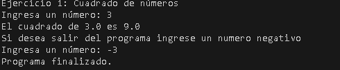
#### Ejercicio 2
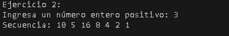
#### Ejercicio 3
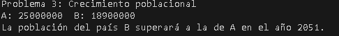
#### Ejercicio 4
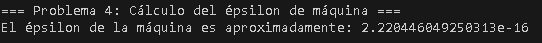
#### Ejercicio 5
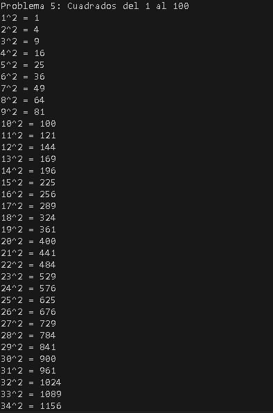
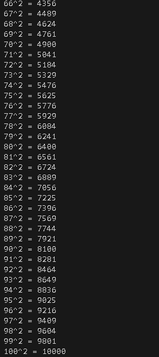
#### Ejercicio 6
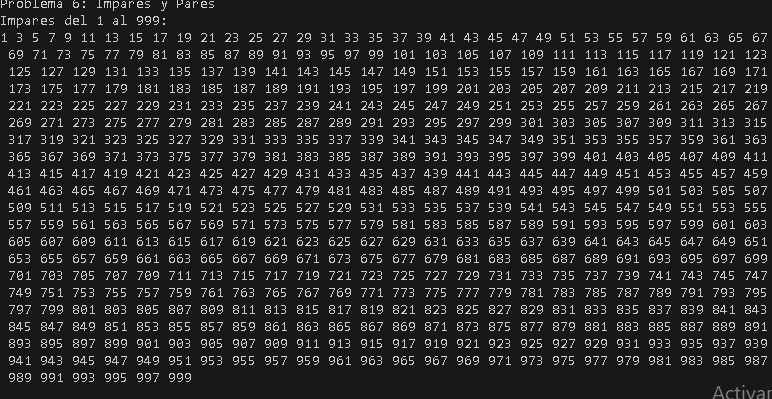
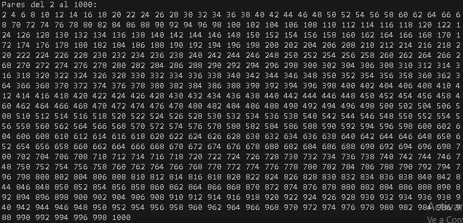
#### Ejercicio 7
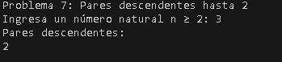
#### Ejercicio 8
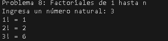
#### Ejercicio 9
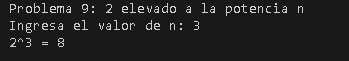
#### Ejercicio 10
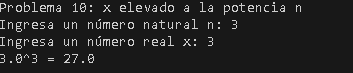
#### Ejercicio 11
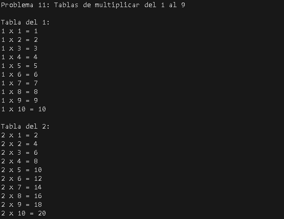
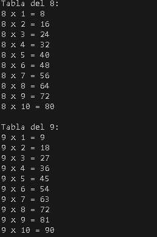
#### Ejercicio 12
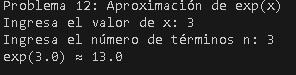
#### Ejercicio 13
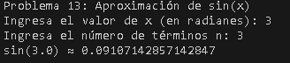